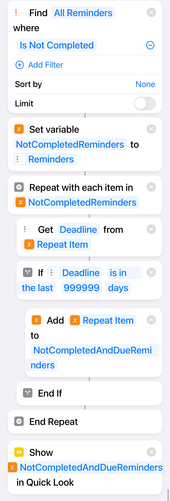
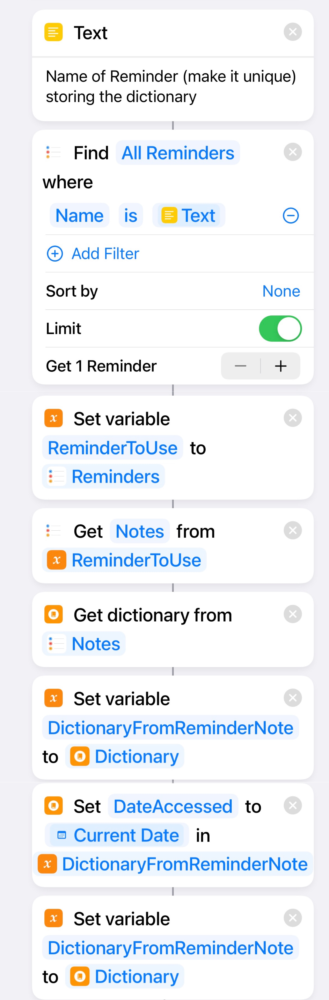
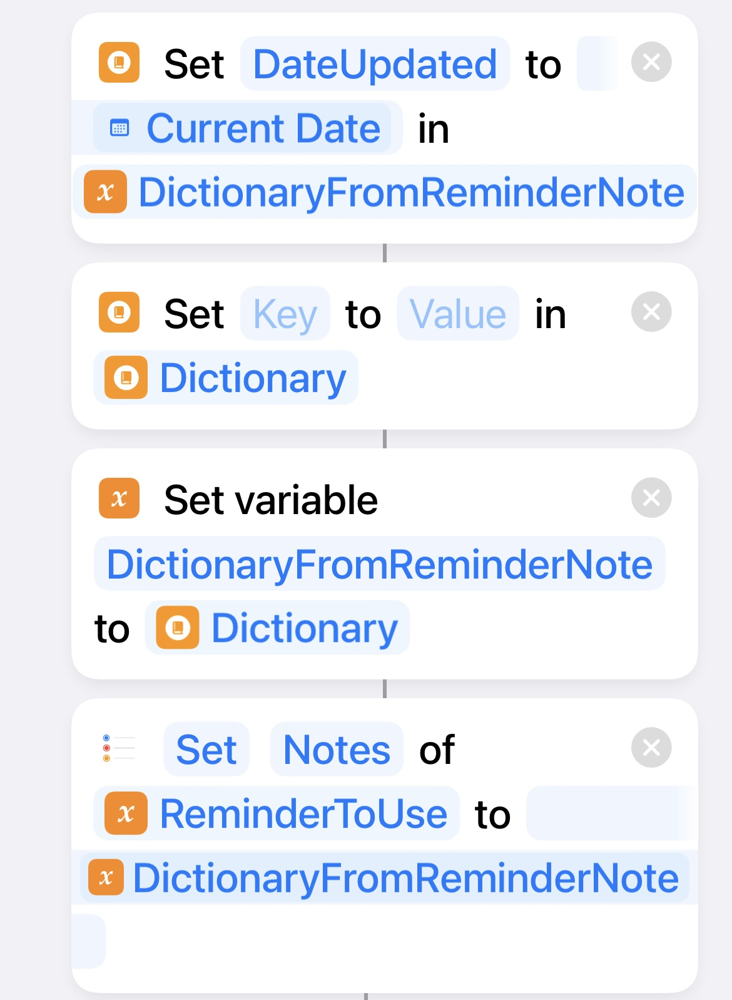

# iOS Shortcuts and Others

(To be) Collection of iOS Shortcuts, scripts, tips, tricks and other interesting tidbits for productivity and fun on the iOS.

For iOS users who want to get more out of our expensive devices. Please pardon any insufficient elaboration.

Your suggestions and contributions are most welcome! :smile:

<!-- Table of Contents when there are enough items -->

<!-- Categorisation when there are enough items -->

## iOS Shortcuts

### Show Overdue And Not Completed Reminders From All
---

This simple shortcut searches through all your reminders and selects those that are _Overdue_ and _not marked as Completed_ . They are assigned to a variable then passed to Quick Look, but you can easily modify and use this list for other purposes.

~~As of iOS 15.5, I can't find a direct filter for Reminder related Shortcuts action that allows filtering by current date, so had to iterate through the reminders instead.~~

Two ways:

1. A simple 3 action approach as follows:

2. A complicated way that iterates through "not completed" reminders to extract those that are also overdue. For adding further differentiated actions in the loop if needed.

The shortcut as follows, you can also find the ".shortcut" [file](Show_Overdue_And_Not_Completed_Reminders_From_All/Show_Overdue_And_Not_Completed_Reminders_From_All.shortcut) in this repo.

It runs without needing to accept any input.

### Use Reminder Notes to Persist Data
---

How does one store small snippets of data that can be subsequently retrieved by future runs of the Shortcut, or by other Shortcuts?

For example, if Shortcut A has already run once today, it shouldn't run again. Or Shortcut B needs to know if Shortcut A has ran today before it execute some actions.

One simple, but rather brittle way is to persist this data in a Note of a Reminder. This is possible because:
- Available Reminder actions allow for editing of reminders, and Notes of reminders can store a decent amount of text (for this purpose). As of iOS 15 this is still possible. The situation for the Notes app is different, available shortcut Actions does not allow editing of note data, only append.
- A typical way to access and manipulate such data is using a Dictionary, which is supported in Shortcuts.
- Dictionary shortcut Actions can serialise and deserialise a dictionary object to and from JSON (text).

A simple example as follows to read and write data as follows: 

Set any "key" and "value" as needed (and repeat this action with different key and value pairs as needed) 

Creating getter and setter shortcuts for scalable reuse, passing appropriate inputs to these getters and setters. Depending on how deep the daisy chaining of calling other shortcuts, this can potentially make the whole thing too brittle (don't lose data even if things break! :grin: )  

Gentle reminder too on:
- Using a unique reminder name that works across *all* your reminders (including shared ones)
- Can be easier to create a separate reminder list reserved for automation and script access, etc.
- If you can avoid using persistent variables, it is best to be so! There's no telling if the ability to edit Notes of Reminders in Shortcuts will be taken away, etc.
- Editing the JSON text directly in the Reminders app is quite easy, in some cases it may be easier to do so to change state than to create elaborate shortcuts :smile:
- If employed to persist variables across devices and users through shared reminders, the time for the remote to be updated can be quite variable... sending messages (be careful about SMS charges if any) can be a more consistent method. 

Although less common, it's still relatively easy to find good examples of other similar approaches  
A random example is [How to make persistent variables for iOS and iPadOS Shortcuts](https://nadnosliw.wordpress.com/2021/10/28/persistent-variables-for-ios-and-ipados-shortcuts/)

[Searching the web](https://duckduckgo.com/?t=ffab&q=persistent+variables+for+ios+shortcuts&ia=web) for more... 

Your mileage may vary on how long before you find a Shortcut too unwieldy to manage...

## FAQs

**Q: Why are there so few items? Where are the rest coming?**

**A:** The backlog is long, the time available is short. The apology is [here](https://upload.wikimedia.org/wikipedia/commons/d/dd/Tips_for_apologizing_for_your_kids.jpg), the patience is requested. The forgiveness is up to you. :smile:

**Q: These are simple things Why is this Readme so lengthy? Why do you need to put this online even?**

**A:** The main intention is to share this with a small group of friends and family who may be interested, and to document this for future me. 

**Q: Why is there even an FAQ for this??**

**A:** Because.

## No Warranty 

The typical "no-warranty" approach applies.

Unless otherwise stated explicitly, what is presented and/or shared in this repository is as-is and the authors make no representations or warranties of any kind concerning what is presented and/or shared, express, implied, statutory or otherwise, including without limitation warranties of title, merchantability, fitness for a particular purpose, non infringement, or the absence of latent or other defects, accuracy, or the present or absence of errors, whether or not discoverable, all to the greatest extent permissible under applicable law.

	
## Acknowledgments

Thanks to all who have suggested, commented, needled and otherwise contributed. You know who you are :smile: . 

## Contact

[github.com/kwloong](https://github.com/kwloong)

