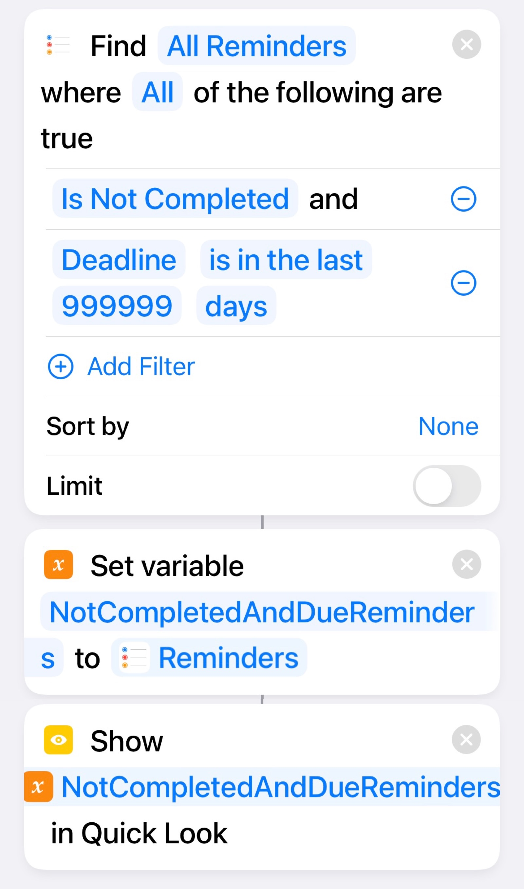

# iOS Shortcuts and Others

(To be) Collection of iOS Shortcuts, scripts, tips, tricks and other interesting tidbits for productivity and fun on the iOS.

For iOS users who want to get more out of our expensive devices. Please pardon any insufficient elaboration.

Your suggestions and contributions are most welcome! :smile:

<!-- Table of Contents when there are enough items -->

<!-- Categorisation when there are enough items -->

## iOS Shortcuts

### Show Overdue And Not Completed Reminders From All

This simple shortcut searches through all your reminders and selects those that are _Overdue_ and _not marked as Completed_ . They are assigned to a variable then passed to Quick Look, but you can easily modify and use this list for other purposes.

~~As of iOS 15.5, I can't find a direct filter for Reminder related Shortcuts action that allows filtering by current date, so had to iterate through the reminders instead.~~

Two ways:

1. A simple 3 action approach as follows:

2. A complicated way that iterates through "not completed" reminders to extract those that are also overdue. For adding further differentiated actions in the loop if needed.

The shortcut as follows, you can also find the ".shortcut" [file](Show_Overdue_And_Not_Completed_Reminders_From_All/Show_Overdue_And_Not_Completed_Reminders_From_All.shortcut) in this repo.

It runs without needing to accept any input.

## FAQs

**Q: Why are there so few items? Where are the rest coming?**

**A:** The backlog is long, the time available is short. The apology is [here](https://upload.wikimedia.org/wikipedia/commons/d/dd/Tips_for_apologizing_for_your_kids.jpg), the patience is requested. The forgiveness is up to you. :smile:

**Q: These are simple things Why is this Readme so lengthy? Why do you need to put this online even?**

**A:** The main intention is to share this with a small group of friends and family who may be interested, and to document this in case there's a future old, forgetful me.  

**Q: Why is there even an FAQ for this??**

**A:** Because.

## No Warranty 

The typical "no-warranty" approach applies.

Unless otherwise stated explicitly, what is presented and/or shared in this repository is as-is and the authors make no representations or warranties of any kind concerning what is presented and/or shared, express, implied, statutory or otherwise, including without limitation warranties of title, merchantability, fitness for a particular purpose, non infringement, or the absence of latent or other defects, accuracy, or the present or absence of errors, whether or not discoverable, all to the greatest extent permissible under applicable law.

	
## Acknowledgments

Thanks to all who have suggested, commented, needled and otherwise contributed. You know who you are :smile: . 

## Contact

[github.com/kwloong](https://github.com/kwloong)

